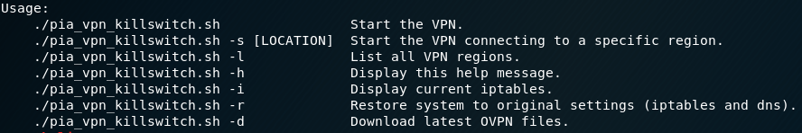

# VPN Killswitch Shell Script for Private Internet Access (PIA)

Bash shell script to start a VPN (openvpn) with a killswitch setup via iptables. Script is specifically written for the provider 'Private Internet Access' (PIA).



Features:
- Start VPN in a specific region (defaults to 'US West): `./pia_vpn_killswitch.sh -s "France"`
- List all VPN regions available from PIA: `./pia_vpn_killswitch.sh -l`
- Allows traffic to/from any private network addresses
- Blocks any packets that are not going through the VPN
- Logs any packets that were dropped due to these rules `tail -f /var/log/syslog`
- Updates /etc/resolv.conf to use PIA DNS servers
- Prompts for VPN credentials and stores in file

Note: the script will make a copy of the OVPN file and update the DNS name to a IP address (e.g. 'remote france.privateinternetaccess.com' to 'remote 194.187.249.52'). Only this IP address is allowed in the iptables rules. Adding a rule to iptables with the DNS name adds all ip addresses returned by the DNS query when its added. This list of IP addresses can sometimes differ from the IP address returned from the DNS query when we try connect to the VPN later with openvpn.  

Getting Started:
```
wget https://raw.githubusercontent.com/darkosancanin/pia_vpn_killswitch/master/pia_vpn_killswitch.sh
chmod +x pia_vpn_killswitch.sh
./pia_vpn_killswitch.sh
```